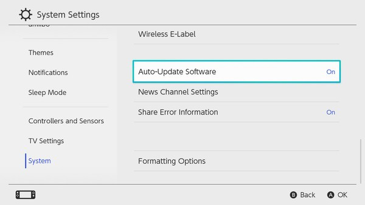

# Switch Cheat Document

[](https://github.com/Pop-Apple/Switch-Custom-Doc/issues)
[](https://github.com/Pop-Apple/Switch-Custom-Doc/blob/master/LICENSE)

<br>

Documention for Safely Installing Custom Firmware on the Switch.

> **Warning**  
> However, modifications should be done at your own risk.  
> We are not responsible for Switch damage, etc.  

---

<br>

## 1.  Check serial number

Enter your Switch's serial number here to check  
if it is solid enough to install a CFW.  

> [Switch SN Checker v1.2.0](https://damota.me/ssnc/checker/)

| 🟢 | 🔴 | 🟡 | 🔵 |
:----:|:----:|:----:|:----: 
| Safe | Patched | Warning | incorrect |

<br>

## 2. What you need

Here is what you will need

> RCM Jig  

> Micro SD **128 GB**

> USB Type **C** Cable

<br>

## 3. Switch main unit settings

First, put the Switch in Airplane Mode.  
This is to prevent IPBan by Nintendo.  
Next, Turn **OFF** Auto-Update Software and Share Error Information.  

<br>



<br>

## 4. 90DNS Setup

Select Internet from the settings and select the wireless or wired connection.  
Choose Change Settings and switch the DNS settings to Manual.  
Rewrite DNS.  

> Changed **preferred** DNS to `163.172.141.219`  
> Changed **alternate** DNS to `45.248.48.62`

**Doing so allows you to use the network in stealth.**

<br>

## 5. Installing Atmosphère

Atmosphère is an ongoing firmware customized for the Nintendo DS.  
Download the simple template ZIP file here and put the file   
on your own micro SD card.  
See the directory tree below for more information.  
After completing the above steps, insert the SD card into the Switch.  

**[Atmosphère v1.5.5](https://github.com/Pop-Apple/Switch-Custom-Doc/raw/master/assets/files/Atmosphere.zip)**

Developing by [Team-Naptune](https://github.com/Team-Neptune)

```
📂 SD:
 │  
 ├──  📂 atmosphere
 │ 
 ├──  📂 bootloader
 │ 
 ├──  📂 config
 │ 
 ├──  📂 switch
 │ 
 ├──  📂 themes
 │ 
 └──  📄 hbmenu.nro
```

<br>

## 6. Switch Hacking

Download the tool below to send a payload to Switch.

**[TegraRcmGUI v2.6](https://github.com/Pop-Apple/Switch-Custom-Doc/raw/master/assets/files/TegraRcmGUI.zip)**

Developing by [Eliboa](https://github.com/eliboa)

Connect the Switch to your PC using the Type C cable.  
Once the connection is complete, turn off the Switch.  
After confirming that the power is off,  
insert the RCM jig into the right joystick  
and press the power button and volume + button  
simultaneously to put the Switch into RCM

**You can check if the Switch is RCM by using the tool.**

|  |  |
:----:|:----:
| Success | Failed |

Initially, complete the driver installation from the Setting tab.  
Next, the payload is sent to the Switch itself.  
Click on the folder symbol on the Payload tab and click  
Select the payload file that is valid for the Switch version.  

In the current version `hekate_ctcaer_6.0.4.bin`, so Select this one.  
The file is located in the following directory  

```
📂 TegraRcmGUI:
 │ 
 └── 📂 favorites
      │ 
      └── 📄 hekate_ctcaer_6.0.4.bin
```

**After selecting the file, click `Inject Payload` to send the payload to the Switch itself.**

<br>

If successful, Hekate will start.  
After setting the date, click **`Launch`**.  


<br>

---

<br>

The screen changes and click **`CFW - SysNAND`**. 


<br>

---

You will then be taken to the DeepSea boot screen.  

<br>


<br>

---

When loading is complete, the Home menu appears as usual,  
but the Switch itself is already in the CFW state.  

**This completes the CFW installation.**  
**Launch the album application and you will be taken to HomeBrewMenu.**

<br>

## Credits

* [Atmosphère](https://github.com/Atmosphere-NX/Atmosphere)

* [TegraRcmGUI](https://github.com/eliboa/TegraRcmGUI)

* [DeepSea](https://github.com/Team-Neptune/DeepSea)

### License

Cheat documentation released under the [GNU General Public License v3.0](https://github.com/Pop-Apple/Switch-Custom-Doc/blob/master/LICENSE)

Please note that the applications used in this cheat document are licensed for each repository.
